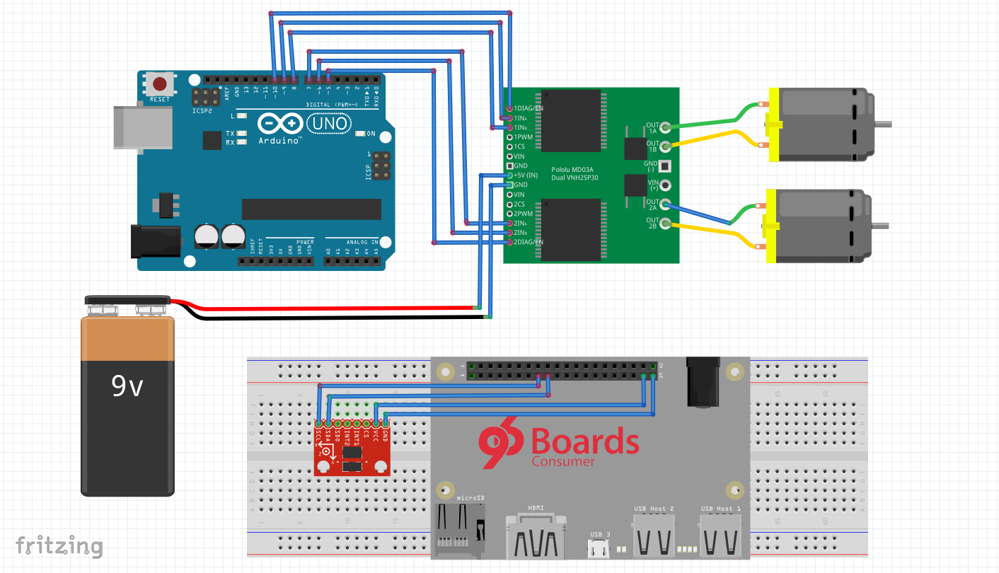

# Self balancing Bot using 96Boards

Self balancing Bot also called as **Segway** is a bot based on **Inverted Pendulum** concept. It balances itself steadily by 
moving forth and back to counteract the fall. IMU (Inertial Measurement Unit) is used to measure the angle of the Bot for 
detecting the slope. Then, the motor position will be updated to keep the Bot steady. **PID** controller will be used to adjust 
the position of motors based on the angle calculated by **IMU**. All of the computations will be done using CE board and 
controlling the DC motor will be offloaded to Arduino present on Sensors Mezzanine. 

# Table of Contents
- [1) Hardware](#1-hardware)
   - [1.1) Hardware requirements](#11-hardware-requirements)
- [2) Software](#2-software) 
   - [2.1) Operating System](#21-operating-system)
   - [2.2) Software Dependencies](#22-software-dependencies)
- [3) Measuring tilt using IMU](#3-measuring-tilt-using-imu)
   - [3.1) Hardware setup](#31-hardware-setup)
- [4) Self Balancing Bot - Rev 1](#4-self-balancing-bot---rev-1)
   - [4.1) Hardware setup](#41-hardware-setup)
   - [4.2) Building](#42-building)
   - [4.3) Self Balancing Bot in action](#43-self-balancing-bot-in-action)
   - [4.4) Video Demonstration](#44-video-demonstration)
- [5) Self Balancing Bot - Rev 2](#5-self-balancing-bot---rev-2)
   - [5.1) Hardware setup](#51-hardware-setup)
   - [5.2) Building](#52-building)
   - [5.3) Self Balancing Bot in action](#53-self-balancing-bot-in-action)
   - [5.4) Video Demonstration](#54-video-demonstration)

# 1) Hardware

## 1.1) Hardware requirements

- [96Boards CE](https://www.96boards.org/products/ce/)
- [96Boards Compliant Power Supply](http://www.96boards.org/product/power/)
- [Sensors Mezzanine](http://www.96boards.org/product/sensors-mezzanine/)
- [Chasis](https://nevonexpress.com/Self-Balancing-Robot-Chassis-Body-Diy.php)
- [IMU 6 DoF - MPU6050](http://www.amazon.in/GY-521-Mpu6050-Accelerometer-Arduino-REES52/dp/B008BOPN40/ref=sr_1_1?ie=UTF8&qid=1501573522&sr=8-1&keywords=mpu6050)
- [Motor Driver - L289N](http://www.amazon.in/Robodo-Electronics-Motor-Driver-Module/dp/B00N4KWYDE/ref=pd_sbs_328_1?_encoding=UTF8&psc=1&refRID=YESQPMRAEF73WTRQPRP1)
- [DC motor](https://robokits.co.in/motors/300rpm-12v-dc-motor-with-gearbox)
- [Dc to DC Boost Converter](http://www.amazon.in/KitsGuru-Step-up-Adjustable-Booster-Current/dp/B00HV59922)
- [11.1v Battery for Board](http://robokits.co.in/batteries-chargers/lithium-ion-battery/li-ion-11.1v-2200mah-2c-with-inbuilt-charger-protection)
- [11.1v Battery for Motors](http://robokits.co.in/batteries-chargers/lithium-ion-battery/lithium-ion-rechargeable-battery-pack-11.1v-2200mah-2c)

# 2) Software

## 2.1) Operating System

- [Linaro Debian based OS (latest)](https://github.com/96boards/documentation/blob/master/ConsumerEdition/DragonBoard-410c/Downloads/Debian.md)

## 2.2) Software Dependencies

```
$ sudo apt-get update
$ sudo apt-get upgrade
```
Install **MRAA** library as specified [here](https://github.com/96boards/documentation/blob/master/ConsumerEdition/guides/mraa/install.md)

# 3) [Measuring tilt using IMU](https://github.com/96boards-projects/imu)

## 3.1) Hardware Setup

- Make sure the 96Boards CE is powered off
- Connect I/O devices (Monitor, Keyboard, etc...)
- Connect Sensors Mezzanine
- Power on your 96Boards CE with compatible power supply

# 4) Self Balancing Bot - Rev 1

This is the first revision of **Self Balancing Bot**. This revision uses complimentary filter for sensor fusion and PID implementation is
done in 96Boards CE. Due to gyroscope drift and accelerometer noise, balancing is not stable.


## 4.1) Hardware Setup



- Make sure the 96Boards CE is powered off
- Assemble the setup in a chasis as per above schematic
- Connect Arduino to 96Boards CE using USB cable
- Power on your 96Boards CE with compatible power supply

>Note:
> 1. Assume Sensors Mezzanine is placed on top of CE board and use groove connector for connecting MPU6050 to I2C0 connector
> 2. Use two separate batteries for powering CE board and Motor driver

## 4.2) Building

***src*** directory in this project contains the source files and ***inc*** contains the header files. 
```
$ git clone https://github.com/96boards-projects/self_balancing_bot.git
$ cd self_balancing_bot/rev_1
$ make
```
## 4.3) Self Balancing Bot in action

After building, object files will get listed under ***obj*** directory and the final executable binary ***motor_control*** would be available in top level directory.

Now, hold the bot in upright position and execute the following command to see Self Balancing Bot in action.

```
$ sudo ./motor_control
```
Bot should stabilize itself by moving back and forth.

>Note: Due to accelerometer drift, bot may fail to stabilize in few moments. This will be addressed in **Rev-2** using DMP.

## 4.4) Video Demonstration

[Demonstration Video](https://www.youtube.com/watch?v=eRnURzfUmaw)

# 5) Self Balancing Bot - Rev 2

The second revision of Self Balancing bot has the following changes compared to first revision:

1. Used DMP in MPU6050 for sensor fusion
2. Offloaded PID calculation to Arduino (Sensors Mezzanine)

## 5.1) Hardware Setup

From the hardware perspective, there is no change from first revision.

- Make sure the 96Boards CE is powered off
- Assemble the setup in a chasis as per above schematic
- Connect Arduino to 96Boards CE using USB cable
- Power on your 96Boards CE with compatible power supply

>Note:
> 1. Assume Sensors Mezzanine is placed on top of CE board and use groove connector for connecting MPU6050 to I2C0 connector
> 2. Use two separate batteries for powering CE board and Motor driver

## 5.2) Building

***src*** directory in this project contains the source files and ***inc*** contains the header files.
```
$ git clone https://github.com/96boards-projects/self_balancing_bot.git
$ cd self_balancing_bot/rev_2
$ make
```
## 5.3) Self Balancing Bot in action

After building, object files will get listed under ***obj*** directory and the final executable binary ***motor_control*** would be available in top level directory.

Now, hold the bot in upright position and execute the following command to see Self Balancing Bot in action.

```
$ sudo ./motor_control
```
Bot should stabilize itself by moving back and forth.

## 5.4) Video Demonstration
